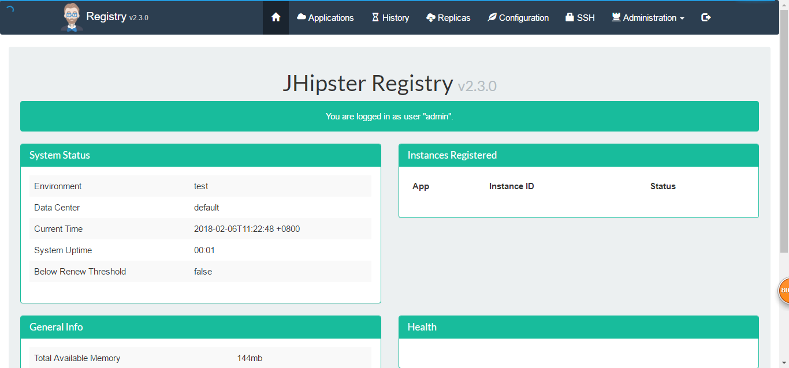
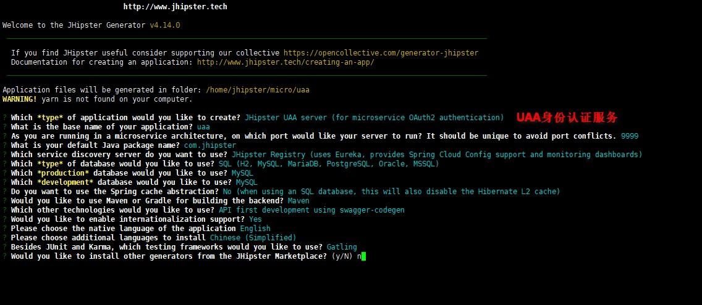
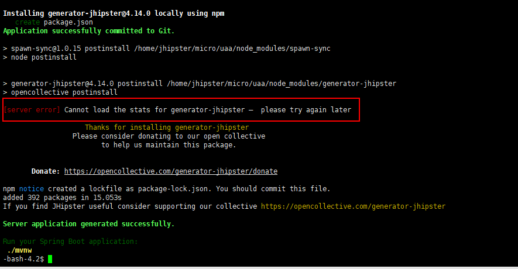
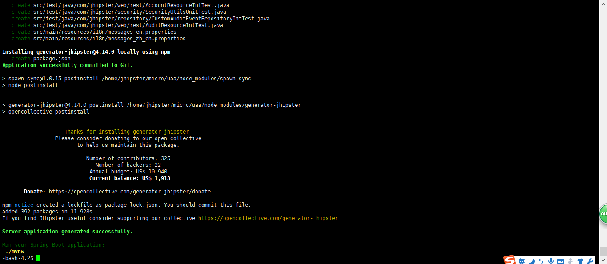
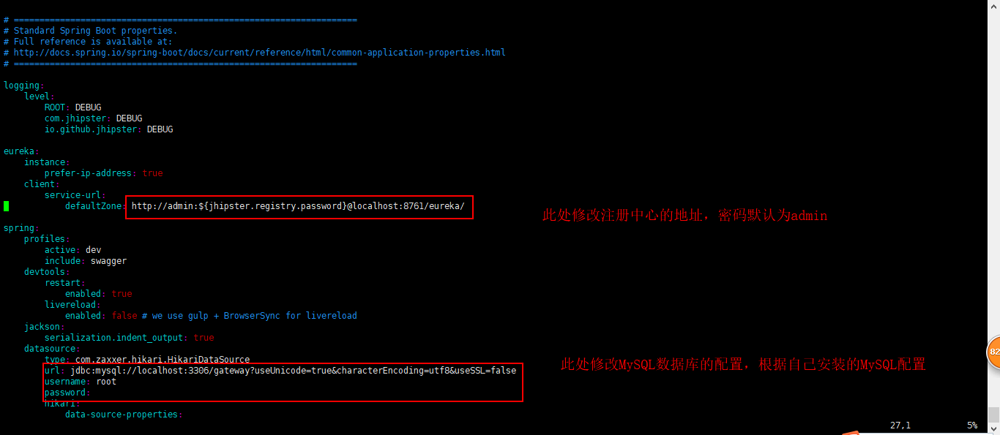
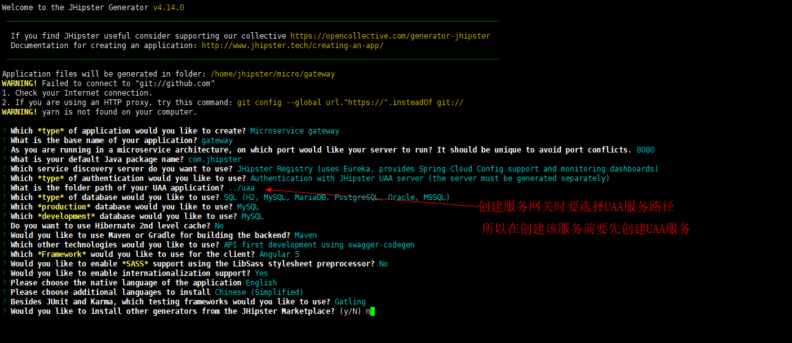
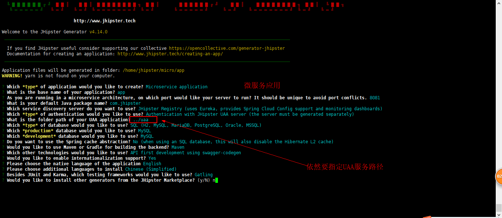
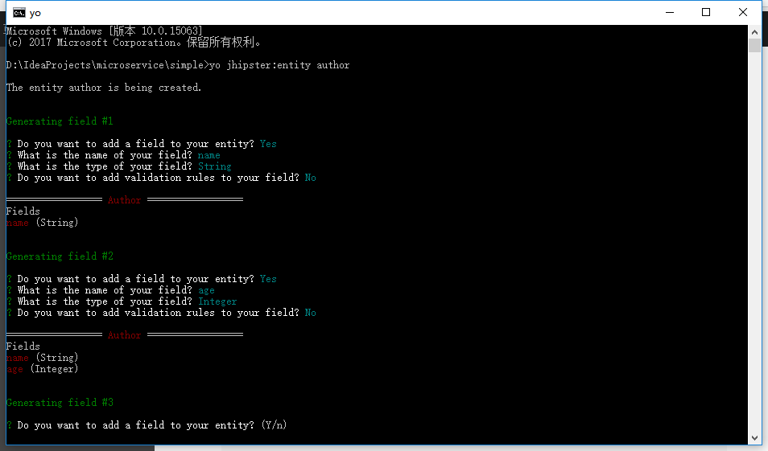
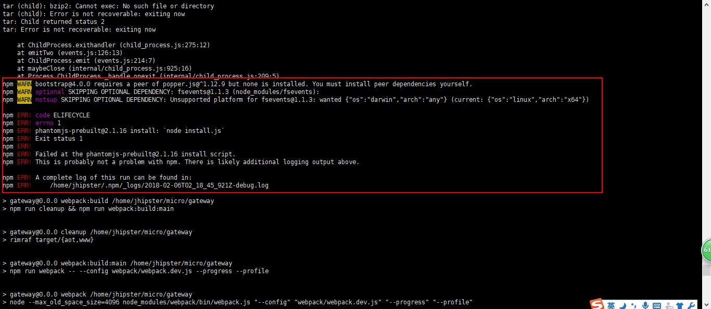
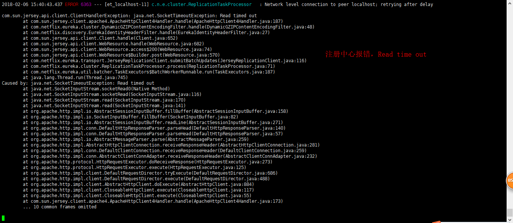

## jhipster

[TOC]

### 1. 环境
- centos7.2
- JDK8
- maven 3.3.9
- nodeJS 8.9.4
- MySQL 5.7
- git

### 2. 配置环境
#### 1. 配置JDK8，maven3.3.9，MySQL
略...
注意：MySQL改授权以及maven的本地仓库设置

#### 2. 安装nodeJS
1. 下载[nodeJs](https://nodejs.org/dist/)，找到8.9.4版本下载，并上传到服务器/usr/local下。
2. 解压
> tar -xf node-v8.9.4-linux-x64.tar.gz

3. 修改名称
> mv node-v8.9.4-linux-x64 node

4. 配置环境变量
> vim /etc/profile

5. 添加以下内容：
>  #set for nodejs
> NODE_HOME=/usr/local/node
> PATH=\$NODE_HOME/bin:$PATH
> export NODE_HOME PATH

6. 验证
> source /etc/profile
> node -v
> npm -v

7. 替换淘宝镜像源
> npm config set registry https://registry.npm.taobao.org

8. Windows下安装nodeJS参见以下文章
[Node.js安装及环境配置之Windows篇](https://www.jianshu.com/p/03a76b2e7e00)


#### 3. 安装GIT
1. 安装git
> yum install git

#### 4. 安装Ruby
1. [下载Ruby](1)（Windows）
2. 点击安装Ruby即可。
3. 配置环境变量，在path中添加Ruby的bin目录。
4. 安装compass。我们只能使用本地安装的方式来安装。本地安装需要下载4个文件：[SASS](http://rubygems.org/downloads/sass-3.2.13.gem)，[Chunky_png](http://rubygems.org/downloads/chunky_png-1.2.9.gem)，[Fssm](http://rubygems.org/downloads/fssm-0.2.10.gem)和[Compass](http://rubygems.org/downloads/compass-0.12.2.gem)。
5. 将这4个文件放在ruby的安装根目录下，如我安装在C:Program Files/ruby，然后打开控制台切换到ruby的安装目录。
6. 命令安装
```
gem install sass
sass -v

gem install compass
gem install fssm
gem install chunky_png
# 以上三个都安装成功，查看compass版本才会成功
compass -v
# 卸载
gem uninstall compass
```

#### 5. 安装phantomjs
1. 安装依赖
> yum -y install wget fontconfig

2. 下载并安装[phantomjs-2.1.1-linux-x86_64.tar.bz2](https://bitbucket.org/ariya/phantomjs/downloads/phantomjs-2.1.1-linux-x86_64.tar.bz2)
> yum -y install bzip2
> tar jxf phantomjs-2.1.1-linux-x86_64.tar.bz2
> 想办法解压bz2文件，然后将bin目录配置到PATH环境中，如果提示权限不足，可以给bin目录下的文件赋权限

#### 6. 安装yarn
> yum install -y yarn
> Windows下直接安装即可

#### 5. 安装jHipster
1. 安装 yo / bower / gulp
> npm install -g yo bower gulp-cli gulp grunt-cli

2. 安装jHipster
> npm install -g generator-jhipster

### 3. 使用jHipster
1. 生成项目
> yo jhipster

注意：不要使用root用户操作，会有权限问题，root用户生成的文件其他用户不能访问，尽量在普通用户下操作。

2. 修改配置文件
> cd ~/jhipster/src/main/resources/config
> vim application-dev.yml
> 修改MySQL数据库的URL以及用户名密码

3. 运行项目
> mvn spring-boot:run

4. 关闭防火墙
> firewall-cmd --zone=public --add-port=8080/tcp --permanent
> firewall-cmd --reload

5. 访问
> http://192.168.24.130:8080/

### 4. jHipster生成微服务
#### 1. 注册中心
1. 从git上下载jHipster注册中心源码
或直接下载该Tag的源码，最新版本在我本机电脑访问时不能显示页面。详情见问题总结。
> git clone https://github.com/jhipster/jhipster-registry/
> git checkout v2.3.0

2. 启动注册中心
> ./mvnw -X 或 mvn pring-boot:run -X

3. 访问注册中心
> http://192.168.24.130:8761



#### 2. UAA 身份认证中心
1. 生成服务
> mkdir uaa
> cd uaa
> yo jhipster

2. 选择UAA服务


在生成服务过程中可能会出现如下错误


可以删除文件重新生成，同一个文件夹下会记录上次的选项，但是直接生成貌似依旧会报错，所以需要删除整个文件夹，然后重新创建文件夹。此时再生成服务时需要再次选择选项。直到出现如下提示才算成功


3. 修改配置文件
> vim src/main/resources/config/application-dev.yml


修改注册中心地址以及MySQL服务配置。

#### 3. 生成微服务网关
1. 生成服务
> mkdir gateway
> cd gateway
> yo jhipster

2. 选择选项


创建过程中一般不会报错，如果出现`Error`，删除文件重新生成即可。

3. 修改配置
> vim src/main/resources/config/application-dev.yml

修改注册中心地址以及MySQL服务配置。

#### 4. 生成微服务应用
1. 生成服务
> mkdir app
> cd app
> yo jhipster

2. 选项


3. 修改配置
> vim src/main/resources/config/application-dev.yml

依然是修改注册中心以及MySQL服务。

#### 5. 生成实体类
1. 进入到需要生成实体类项目的根目录下
> cd app

2. 执行命令生成实体类
> yo jhipster:entity entityName


注意：生成实体时要慎重选择对应关系，复杂的对应关系代表着复杂的处理逻辑。

3. 生成实体后在页面可以进行操作


-------------------------

### 10. 异常处理
#### 1. 解压bz2文件
**描述：**解压bz2文件时报错
tar (child): bzip2: Cannot exec: No such file or directory

**解决：**tar命名解压bz2文件时需要安装bzip2命令，执行命令`yum -y install bzip2`，然后在tar命令解压即可。

#### 2. jhipster项目启动后显示空白页
**描述：**jhipster项目启动后显示空白页，后台并不见日志滚动，貌似没有请求到后台。

**解决：**还是环境搭建的有问题，把依赖全部卸载后重新装一遍即可，但是大致原因可能是差了某个东西，第一次装没有安装 grunt-cli 和 Ruby的东西。在Linux中没有安装Ruby也可以，而在Windows上没有安装这些的时候就有问题。所以生成项目有问题时要检查一遍环境是否全部已经安装完毕。保证没有少安装

#### 3. 缺少依赖

**描述：**具体错误可查看日志详细内容，`PhantomJS not found on PATH`，本次错误是缺少PhantomJS 依赖，由程序下载安装包后不能解压导致。

**解决：**自行安装PhantomJS依赖并配置环境。

#### 4. server error

**描述：**在生成jhipster项目时报错，`[server error] Cannot load the stats for generator-jhipster – please try again later`

**解决：**删除文件，重新生成项目即可，如果还不行，则删除该项目的文件夹，从新建文件夹开始重新操作。

#### 5. 数据库变化
**描述：**当启动项目时报错
your database is NOT ready: Validation Failed:
1 change sets check sum          config/liquibase/changelog/00000000000000_initial_schema.xml::00000000000001::jhipster was: 7:1a93aa1077a0f85c08092bf95f44c635 but is now: 7:9d88ecd533d5a3530e304f778b9dc982

**解决：**原因是每个不同的应用使用了同一个数据库，从而导致数据库记录与程序记录不一致导致，
1. 可以修改默认配置，不使用自动生成表结构
2. 每次启动不同应用前都删除数据库中的表
3. 不用管，项目依然可以启动

#### 6. 超时问题

**描述：**当虚拟机中同时启动四个应用时，所有服务全部都报错，Read time out或者是null

**解决：**经查看是虚拟机内存以及交换空间全部占满，导致应用反应慢，产生连锁反应导致超时。
1. 调整内存以及交换空间的大小
2. 尽量启动少量的服务来测试
3. 如果可以不要在同一虚拟机中进行操作

#### 7. yarn的问题
**描述：**安装yarn后，输入 yarn -v 命令，提示没有设置 HADOOP_CONF_DIR。

**解决：**原因是安装了yarn，同时path里也配置了Hadoop的环境变量，而在HADOOP_HOME/bin下也有一个yarn的命令，将其删掉即可。（或直接改个名字）


-----------------------------------------------------------------
参考文章：
1. [Node.js安装及环境配置之Windows篇](https://www.jianshu.com/p/03a76b2e7e00)
2. [jhipster 安装](https://note.youdao.com/share/?id=abe7cb945ed1158cfab77e14705fd663&type=note#/)
4. [jhipster-book.pdf](1)
5. [jhipster学习心得](https://www.jianshu.com/p/621dfb94c3b6)
6. [jHipster - 微服务搭建](https://www.jianshu.com/p/d3e6d2d73199)